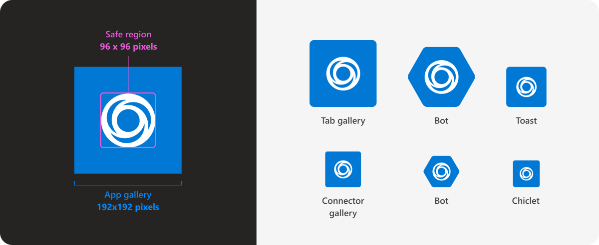

# Automating Azure Cost Management

We're not perfect. Sometimes a resource that should be shut off doesn't get shut off, and you come back on Monday to see your budget is exceeded due to this. There's many different things you can do when a budget is exceeded, but for this demo we'll be taking the action of shutting down all VMs in a resource group. In a production environment, care should be taken to define what actions are acceptable to take. However, as this resource group is a non-production lab, we can assume it is safe to simply shut down all VM resources in the event our budget alert is triggered.

## Creating a Runbook

In our Resource Group, we'll start by creating an Azure Automation resource to house our Runbook. This will be used to define the set of actions to take when our budget is exceeded. Click the Create button on the Resource Group overview

 (1).png>)

In the Marketplace, we'll search for and create the "Automation" resource

 (1).png>)

On the Basics tab, we'll set Subscription, Resource Group, Name, and Region Info. As this Automation Account can be used for many runbooks, we'll give it a more generic name of "LabAutomation". We can then proceed straight to the Review + Create tab and create the resource

 (1).png>)

Once the deployment finishes, we'll proceed to the Runbooks tab under Process Automation in the newly created Automation Account resource

 (1).png>)

We'll use an existing runbook, so select the option to Browse Gallery

<figure><figcaption></figcaption></figure>

Search for and Select the Stop Azure V2 VMs Runbook

.png>)

On the Import page, name and import the Runbook

<figure><figcaption></figcaption></figure>

You'll then be taken to a graphical editor. Publish the Runbook

 (1).png>)

## Creating an Action Group

Next, we need to define a group of actions to take when a budget alert is triggered. To create this, we'll start by going back to our Resource Group to the Alerts tab in the left navigation bar

 (1).png>)

Then click the Create button, and select Action Group

 (1).png>)

On the Basics tab, we'll define our Subscription, Resource Group, Region, and Name

<figure><figcaption></figcaption></figure>

Proceed to the actions tab. Here we'll link our Automation Account and runbook to this action group. Start by setting the action type to Automation Runbook

 (1).png>)

In the Configure Runbook flyout, set the Runbook Source to User, then select the subscription, Automation Account, and Runbook you created. Select Configure Parameters.


You may get an Unsaved Changes pop-up when clicking Configure Parameters. This seems to be a bug, and you can proceed anyways


Set the RESOURCEGROUPNAME parameter to the name of your resource group, click OK on the Parameters, then click OK on the Configure Runbook flyout. Name the action and create the Action Group

## Assigning Actions to our Budget

Lastly, we need to tie it all together. Let's tell our budget about this new action group so it can fire it off when the conditions are met. Return to the budget you created in the Resource Group's Budget tab

<figure><figcaption></figcaption></figure>

Edit the Budget

.png>)

In the Set Actions tab, we can now define our Action Group as part of our 80% used threshold, or create a new condition

 (1).png>)

And that's it! By following this guide, you've defined an automation runbook to shut down VMs, added it to an Action Group, and assigned that Action Group to your Budget Actions to ensure costly resources are shut down if you're about to exceed your desired spending.&#x20;
