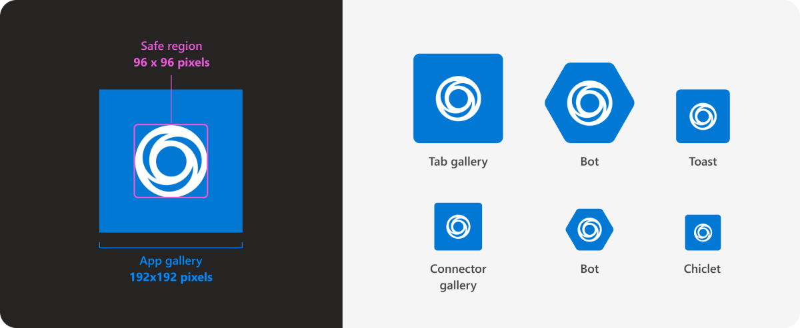

# Packaging Your Bot

### Why deploy as an app?

Deploying your bot as an app has several advatages, including allowing it to be pinned to a user's app list for quick access, show suggestions for actions it can tage, and provide a method to collect ConversationIds for an entire organization, among other things. 

### Creating an App Package

To create an app package, you need three things. A color logo, an outline logo, and a manifest JSON file. Let's start with the icons, as they do need to be in a consistent format. To make things easy, go ahead and create a new directory now to hold all these items.

#### The Color Icon

This is fairly straight forward and is the primary icon for your bot people see when they message it. We'll need this image to meet the following requirements:

* Image must be 192x192px with background
* Background must be solid or transparent
* Icon within image must reside in a "safe region" of the center 96x96px

Visually, this is the guide provided by Microsoft

<figure><figcaption><p>Credit to Microsoft for image</p></figcaption></figure>

&#x20;We'll save this image in our directory as `color.png`

#### The Outline Icon

This one is a bit trickier, and represents the outline shown when the app is pinned to the sidebar of teams. As these icons are monochromatic and color matched to the current theme in the frontend, our outline icon must also be either white with a transparent background, or transparent with a white background. No other colors will work, it may accept the icon but end up looking exceptionally janky in the Teams client. This icon simply needs to be 32x32px, as there is no background.

<figure><figcaption><p>Credit to Microsoft for image</p></figcaption></figure>

For more information on the icon formatting, [reference this Microsoft document](https://learn.microsoft.com/en-us/microsoftteams/platform/concepts/build-and-test/apps-package#app-icons). Save this outline icon as `outline.png`

#### The JSON Manifest

This is the fun part where we actually glue everything together. We'll start with the basic schema that contains all the required bits for our usage:

```json
{
    "$schema": "https://developer.microsoft.com/json-schemas/teams/v1.16/MicrosoftTeams.schema.json",
    "manifestVersion": "1.16",
    "version": "1.0.0",
    "id": "%MICROSOFT-APP-ID%",
    "developer": {
        "name": "Publisher Name",
        "websiteUrl": "https://example.com/",
        "privacyUrl": "https://example.com/privacy",
        "termsOfUseUrl": "https://example.com/app-tos"
    },
    "name": {
        "short": "Name of your app (<=30 chars)",
        "full": "Full name of app, if longer than 30 characters (<=100 chars)"
    },
    "description": {
        "short": "Short description of your app (<= 80 chars)",
        "full": "Full description of your app (<= 4000 chars)"
    },
    "icons": {
        "outline": "A relative path to a transparent .png icon — 32px X 32px",
        "color": "A relative path to a full color .png icon — 192px X 192px"
    },
    "accentColor": "A valid HTML color code.",
    "bots": [
        {
            "botId": "%MICROSOFT-APP-ID-REGISTERED-WITH-BOT-FRAMEWORK%",
            "scopes": [
                "team",
                "personal",
                "groupChat"
            ],
            "commandLists": [
                {
                    "scopes": [
                        "personal",
                        "groupChat"
                    ],
                    "commands": [
                        {
                            "title": "Personal command 1",
                            "description": "Description of Personal command 1"
                        },
                        {
                            "title": "Personal command N",
                            "description": "Description of Personal command N"
                        }
                    ]
                }
            ]
        }
    ]
}
```

Looks like a lot, but let's break it down. These are the more backend properties you don't generally need to worry about:\
`$schema` is a URL reference to the JSON schema used.\
`manifestVersion` is the version of app manifest schema users\
`version` is the version of your app, so 1.0.0 for the initial release


Not sure how to number your app versions? Check out [Semantic Versioning](https://semver.org/)


Next, we have the bits we need to change:

`id` is your bot's ID as it shows in the Bot Framework. This can be found in the Configuration tab of your Azure Bot under "Microsoft App ID"\
`developer.name` is the name you wish to publish the app under, such as `GigaCode`\
`developer.websiteUrl`,  `developer.privacyUrl`, and `developer.termsOfUseUrl` are fairly self explanitory, and should point to your domain.\
`name.short` is a maximum 30 character short name for your app\
`name.full` is a maximum 100 character full name for your app, and must be different than the short name\
`description.short` is a maximum 80 character description of your app\
`description.full` is a maximum 4000 character description of your app\
`icons.outline` is the relative path to your outline icon. Assuming it is stored in the same directory as the manifest, this can be set to `outline.png`\
`icons.color` is the relative path to your color icon. Assuming it is stored in the same directory as the manifest, this can be set to `color.png`\
`accentColor` is any valid HTML color code to use as a background for icons

Finally, we have the fun part where we can customize even further:

`bots.botId` is the same id defined earlier from the bot framework\
`bots.scopes` defines where your bot can be called from: A `team`, `groupChat`, or `personal` conversation

`bots.commandLists` is where we can define the action "hints" to provide to users when they click the chat box:

`bots.commandLists.scopes` defines the scope of where these commands will be shown, using the same `team`, `groupChat`, or `personal` conversation types\
`bots.commandLists.commands` is where we can start defining objects for our suggestions. `title` will be the most visible part shown to users, and what is entered into the chatbox when clicked. `description` is a smaller area of text below the title to provide the user with further context on the item selected

Want different commands for different scopes? Just make a new object containing the above data in the `bot.commandLists` array!

#### Packing it all up

Now that we have our icons and manifest ready, and they're all in the same directory, we can turn this into a format Teams can recognize. Which is.... a simple ZIP file!

Yup, that's it. Right-click and "Compress to ZIP file" is all you need to do:\
.png>)

### Importing to Teams

Importing is just as easy if you are just adding for yourself. Go to the Apps tab in your Teams client as a Teams Admin, click "Manage your apps", then "Upload an app" and select the zip file you made

<figure><figcaption></figcaption></figure>

You will then see an option to install and open the app:\


<figure><figcaption></figcaption></figure>

### Bulk Deploying the App

Individual installs are alright for testing, but what if we want to deploy this to all our internal users at once (or to a client)? We can utilize Teams policies to accomplish this goal.

First, head to the Teams Admin center at [https://admin.teams.microsoft.com/](https://admin.teams.microsoft.com/). Select Teams apps, then Manage apps in the navbar\
.png>)

If you've already uploaded the app as an admin, it should be in this list. Otherwise, click the "Upload new app" button and upload the ZIP package

<figure><figcaption></figcaption></figure>

Let's click on our bot and take a look at the options real quick before moving on. Note the Upload File button under New version. This is where you can provide new packages with updated commands or logos

<figure><figcaption></figcaption></figure>

Now that we have our app uploaded to our organization, let's make a policy to install it. Head over to the Setup policies tab under Teams Apps\
.png>)

We'll click the Add button to add a new policy\
.png>)

Give the policy a name and description. Optionally, you can also control the settings here to allow users to upload and pin their own custom apps. By default, standard users cannot upload their own apps.

<figure><figcaption></figcaption></figure>

Under Installed apps, click Add apps and select your bot

<figure><figcaption></figcaption></figure>

The list of installed apps should show our bot and its ID once selected. Optionally, you can pick any other apps you'd also like to install on behalf of users here.

<figure><figcaption></figcaption></figure>

In the Pinned apps section, we can define what should show in the left navigation bar in the teams client and its order for our users. You can add your bot here to make it highly visible and drive further adoption\


<figure><figcaption></figcaption></figure>

We can now save our policy. We now have to assign users to our app policy, and we have two ways to accomplish this. First, by highlighting our policy and selecting Manage users, then add users to assign individual accounts\


<figure><figcaption></figcaption></figure>

To bulk assign users by groups, go to the Group policy assignment tab above the policy listings. No, this does not refer to Active Directory Group Policy despite the name\
.png>)

Click add, then select a group. We'll use "All Users" to make things easier. We can then select our policy and set the rank. The rank number specifies which policy should be inherited for members of multiple groups - the higher the rank the more precedence it takes\


<figure><figcaption></figcaption></figure>

And that's about it! After the required 30-90 "Microsoft Minutes" the app should start to appear in users Teams clients, and you will start to receive POSTs to your messaging endpoint containing conversation IDs webhook for `installationUpdates`
